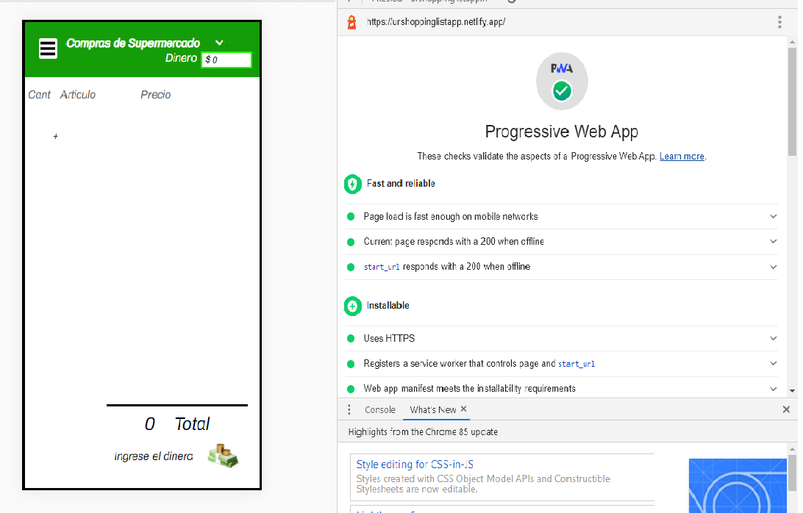
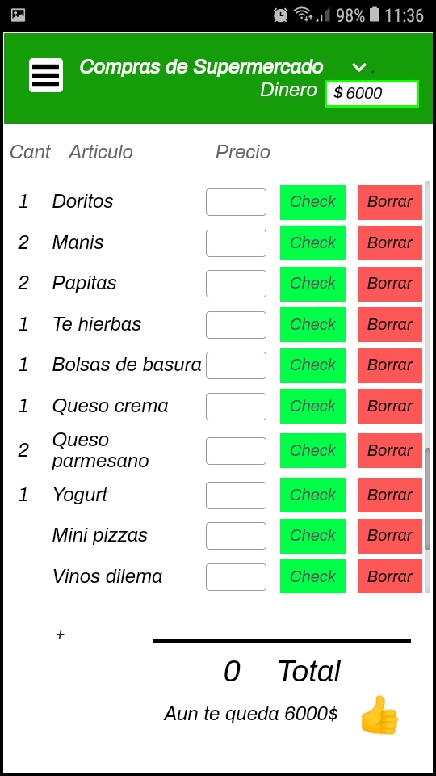
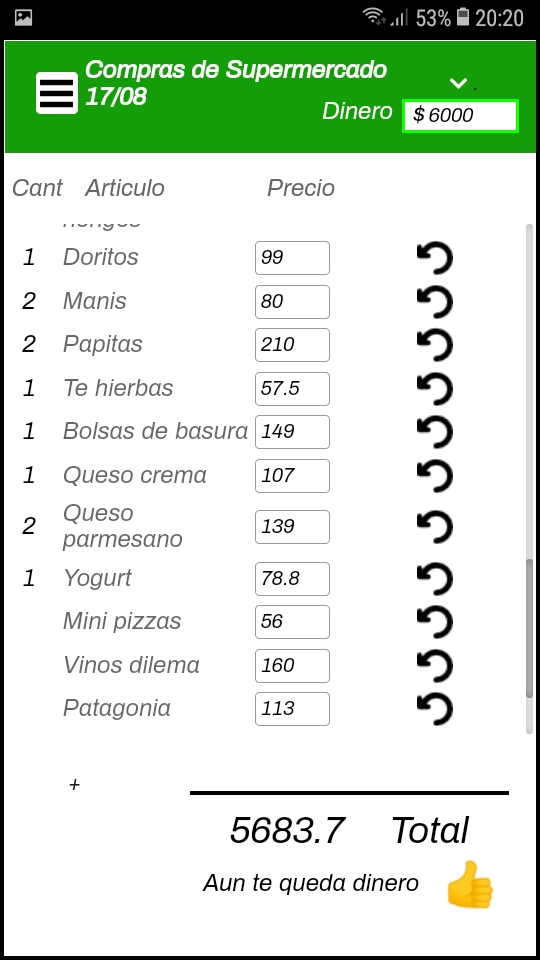
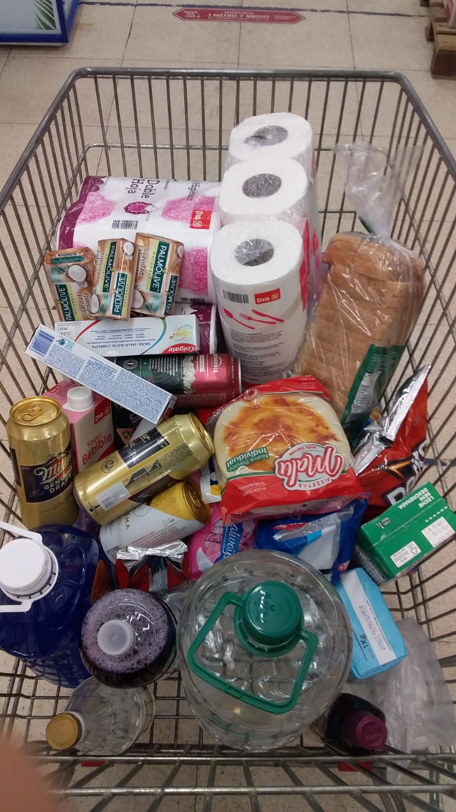
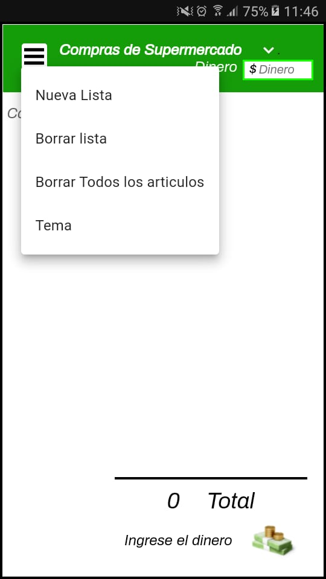
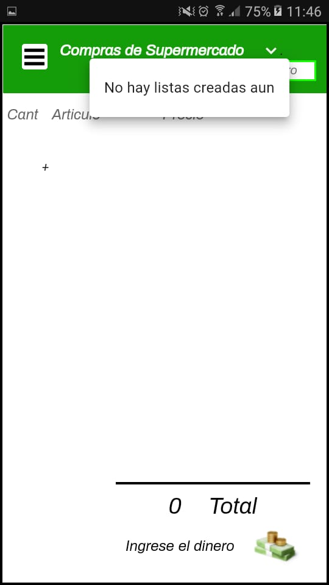

# Shopping:list_app
This repository contains the code of an application I created for my family. 

## About the app
This is a Progressive Web App build on React.js very similar to the classic to do list app but with a couple of additional features and other characteristics that remain to be developed. 

The main objective of the app is to create a home list of items to be purchased at the supermarket and to establish the money to be spent on that purchase.
Then once in the supermarket, as the items are obtained you can add the value of the price of each item and the app is in charge of showing the total spent and the rest of the money established, indicating if there is still money left or not. 

The characteristics that are still to be developed would be: 
Enable function to create new list.
Enable function to create delete list.
Enable function to delete all items from the list.
Create a function to change color theme to header and background.

## How to run.
  1. In your terminal, navigate to the repository directory. `...\Shopping_list_app>`
  2. Run npm install to install all dependencies. `...\Shopping_list_app>npm install` 
  3. Run npm start to start the app. `...\Shopping_list_app>npm start`
  4. If everything works, it should automatically open a tab in your default browser with the address http://localhost:3000/.
    
## Or you can also see it like a web app deploy at:
<a href="https://urshoppinglistapp.netlify.app">Shopping List App on netlify</a>

## Progressive-Web-App's testing ScreenShots  
### Lighthouse Progressive Web App test

### Making a shopping list at home

### at the Supermarket

### Features that remain to be developed. 

# I hope you have a good time and enjoy it.
